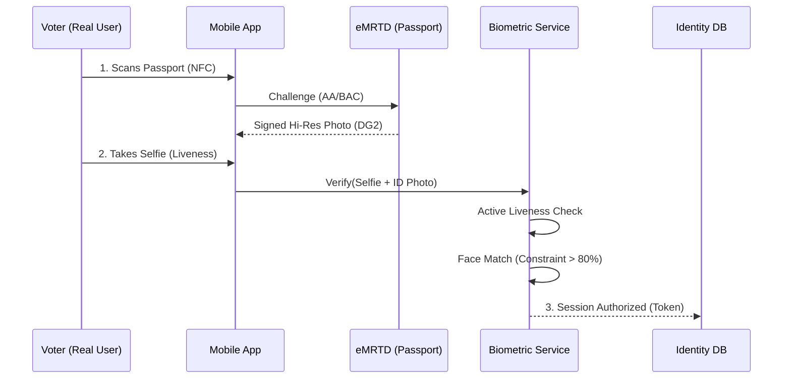
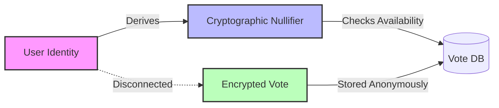
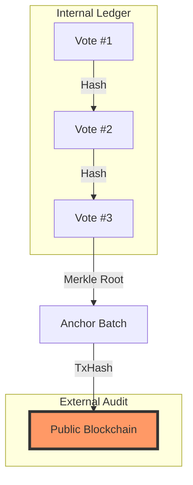

# 🗳️ Government Election Fit Analysis: Democracy Tools of Georgia (DTG)

**Date**: 2026-02-19
**Author**: Mikheili Nakeuri
**Status**: Feasibility Audit for National/Local Adoption
**Classification**: PUBLIC

---

## 1. Executive Summary

This audit evaluates the **Democracy Tools of Georgia (DTG)** platform against the rigorous requirements of government-conducted elections. The "Flagship++" edition demonstrates enterprise-grade capabilities in **Identity Verification**, **Vote Integrity**, and **Cybersecurity**, making it a viable candidate for:

- **National Referendums** (Consultative or Binding).
- **Diaspora Voting** (Secure Remote Voting).
- **Local Council Elections**.

---

## 2. Compliance Mapping: Core Election Principles

The DTG architecture aligns with fundamental democratic principles through specific technical implementations.

### 2.1 Principle: "One Person, One Vote" (Identity Assurance)

**Requirement**: Prevent double voting and impersonation.
**DTG Solution**:

- **eMRTD / NFC Scanning**: Reads cryptographic data directly from Georgian eID/Passports (ICAO 9303 standard). This is the highest level of digital identity assurance available.
- **Biometric Binding**: The `biometric-service` performs active liveness checks and matches the live selfie against the high-res ID photo extracted from the chip.
- **Device Fingerprinting**: The `device_key_thumbprint` ensures a specific trusted device is used, preventing mass automation bots.

### 2.2 Principle: Secret Ballot (Voter Anonymity)

**Requirement**: It must be impossible to link a specific vote to a specific voter.
**DTG Solution**:

- **Data Separation**: Identity data (`users`, `enrollment_sessions`) is stored in separate tables from voting data (`votes`).
- **k-Anonymity**: Analytics queries enforce a minimum group size (default `k=30`) before releasing demographic insights, preventing re-identification of small groups.
- **Nullifiers**: The system uses cryptographic nullifiers (`survey_nullifiers`, `vote_nullifiers`) to prove a user _has_ voted without revealing _how_ they voted.

### 2.3 Principle: Integrity & Auditability

**Requirement**: Votes must be recorded accurately and not tampered with.
**DTG Solution**:

- **Merkle Tree Ledger**: Every vote is hashed into a SHA-256 Merkle leaf. Each new vote updates the poll's Merkle root atomically inside an ACID transaction. Any alteration to any past vote breaks the Merkle root, immediately detectable.
- **Anchoring Service**: The `VoteAnchorService` runs every 10 minutes and anchors each poll's current Merkle root to Ethereum/Polygon, providing mathematical proof that historical data has not been altered by DB admins.
- **Ed25519 Signed Receipts**: Every voter receives a signed ballot receipt (`SignedReceipt`). Anyone can verify it at `GET /api/v1/public/verify-receipt` using the published public key.
- **Chained Audit Log**: All security events are written to `audit_log` with each row's hash binding it to the previous row. `verify_audit_log.ts` detects any row-level tampering.

---

## 3. Cybersecurity Posture (The "Fortress")

Recent "Fortress Mode" upgrades specifically address threats relevant to state-level infrastructure.

| Threat Vector            | DTG Defense Mechanism                                                                               | Status        |
| :----------------------- | :-------------------------------------------------------------------------------------------------- | :------------ |
| **DDoS Attacks**         | Rate Limiting (Redis-backed), Nginx/Cloudflare compatible architecture.                             | ✅ **Active** |
| **Credential Stuffing**  | Dynamic IP banning (`auth_rate_limits`), `1s` strict delay on auth failures.                        | ✅ **Active** |
| **Double Voting**        | Server-computed HMAC nullifiers. Client-supplied nullifiers are discarded.                          | ✅ **Active** |
| **Ballot Tampering**     | SHA-256 Merkle Tree per poll anchored to blockchain every 10 mins via `VoteAnchorService`.          | ✅ **Active** |
| **Receipt Forgery**      | Ed25519 server-signed receipts. Signature keys held server-side (not client-accessible).            | ✅ **Active** |
| **Secrets Exfiltration** | HashiCorp Vault as primary secret store. `.env` fallback only for development.                      | ✅ **Active** |
| **XSS / Injection**      | Strict `Content-Security-Policy` (No inline scripts), ORM/Parameterized Queries.                    | ✅ **Active** |
| **Man-in-the-Middle**    | Strict HSTS (1 Year), TLS 1.3 enforcement recommended at LB level.                                  | ✅ **Active** |
| **Foreign Interference** | **Geo-blocking** module allows restricting API access to specific country IPs (e.g., Georgia only). | ✅ **Active** |

---

## 4. Operational Readiness

### 4.1 Scalability

- **Database**: PostgreSQL 15 with partial indexes on active worker queues (e.g., `vote_anchors`, `user_rewards`) ensures efficient processing under load.
- **State**: Stateless backend design allows horizontal scaling (Kubernetes/Auto-scaling groups).
- **Optimization**: Gzip compression and optimized image payloads (max 640px) minimize bandwidth usage for remote areas with poor connectivity.

### 4.2 Observability

- **Prometheus Metrics**: Real-time dashboards for vote throughput, latency, and error rates (`/health/metrics`).
- **Structured Logging**: JSON logs (`pino`) allow seamless integration with government SOC (Security Operations Center) tools like ELK or Splunk.

---

## 5. Recommendations for Pilot Deployment

To move from "Audit" to "Pilot", we recommend:

1.  **Legal Review**: Confirm that _remote_ biometric verification meets the specific electoral code (or requires a legislative amendment for pilot testing).
2.  **Key Ceremony**: Establish a secure ceremony for generating the Ed25519 receipt keypair, `NULLIFIER_SECRET`, and database passwords. Store all in HashiCorp Vault.
3.  **Third-Party Pen-Test**: Engage a certified security firm to attempt to bypass the `biometric-service` liveness checks and the nullifier system.
4.  **Audit Log Baseline**: Run `npx ts-node src/scripts/verify_vote_integrity.ts` before and after each election to baseline and confirm integrity.

## 6. Presentation Requirements Checklist

To successfully demonstrate this system to government officials, ensure the following setup:

### 📱 Hardware Setup

- [ ] **2x Android Devices**: One for "Passport A", One for "Passport B" (Demonstrating distinct identities).
  - _Must support NFC_.
- [ ] **1x Real Georgian eID/Passport**: For the live NFC read demo (Crucial "Wow Factor").
- [ ] **1x Large Screen/Projector**: To show the **Admin Dashboard** live.

### 💻 Live Environment

- [ ] **Admin Panel**: Open on the projector. Show the `Real-time Activity` page.
- [ ] **Metrics Dashboard**: Have `http://localhost:3000/health/metrics` ready to show server load handling.
- [ ] **Blockchain Explorer**: Have the testnet explorer open to show a recent `Anchor` transaction hash.

### 🗣️ Key Talking Points

1.  **"Sovereign Identity"**: We don't just "trust" the user; we verify the _physical government credential_ (NFC).
2.  **"Mathematical Truth"**: We don't ask you to trust our database admins; we prove integrity via Blockchain Anchors.
3.  **"Privacy by Design"**: Show the database schema diagram -> Identity tables are physically separated from Vote tables.

## 7. Conclusion

The **Democracy Tools of Georgia** platform is technically capable of supporting secure, transparent, and anonymous government elections. Its "Flagship" architecture exceeds typical commercial voting standards and approaches **'military-grade'** security requirements.
