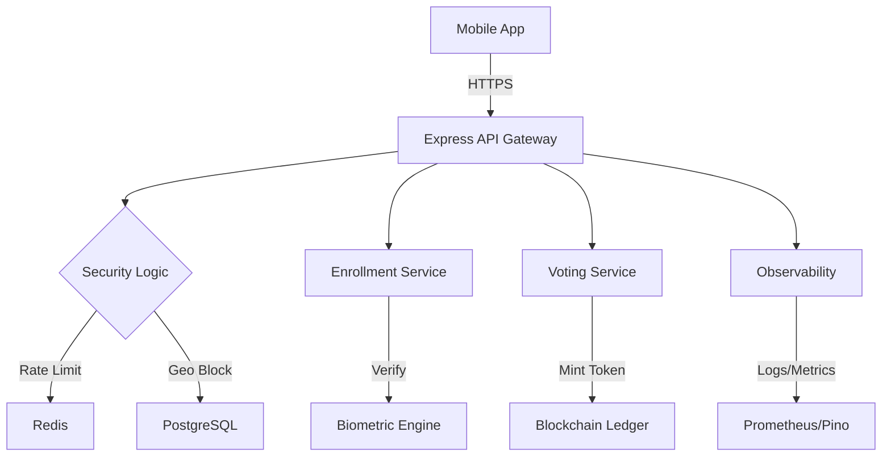

# Democracy Tools of Georgia (DTG) 🇬🇪

**Democracy Tools of Georgia (DTG)** is an enterprise-grade, secure, and transparent digital voting and referendum platform. It leverages cutting-edge technologies like **NFC document scanning**, **AI-driven biometrics**, and **Blockchain immutability** to ensure the integrity of democratic processes.

---

## 🚀 Key Features

### 🛡️ Secure Enrollment (eMRTD)

- **NFC Scanning**: Direct reading of ePassports and ID cards via NFC (ISO/IEC 14443).
- **MRZ Verification**: Optical Character Recognition (OCR) fallback for machine-readable zones.
- **Biometric Liveness**: AI-powered anti-spoofing to ensure the physical presence of the user.
- **Face Matching**: High-precision comparison between document portraits and live selfies.

### 🗳️ Transparent Voting

- **Blockchain Core**: Votes are recorded as immutable tokens (ERC-1155) on a private/public Ethereum-compatible ledger.
- **Referendum Engine**: Dynamic creation and management of polls with complex audience filtering.
- **Privacy First**: Cryptographic hashing and anonymization of voter identities.

### 📊 Enterprise Infrastructure

- **Real-time Observability**: Structured logging with **Pino** and metrics aggregation with **Prometheus**.
- **Security Hardening**: Multi-layered rate limiting, geo-blocking, and OWASP-aligned API security.
- **DevOps Ready**: Multi-stage Docker builds with non-root execution and graceful service termination.

---

## 🛠️ Technology Stack

| Component          | Technology                                            |
| :----------------- | :---------------------------------------------------- |
| **Mobile App**     | Flutter, Provider, BLoC, NFC Manager, Liveness SDK    |
| **Backend API**    | Node.js, TypeScript, Express, Pino Logger             |
| **Blockchain**     | Solidity, Ethers.js, ERC-1155 / ERC-20                |
| **Data Layers**    | PostgreSQL (Persistence), Redis (Caching/Rate-Limits) |
| **Observability**  | Prometheus, Grafana, Pino-HTTP                        |
| **Infrastructure** | Docker, Multi-stage Builds, GitHub Actions            |

---

## 🏗️ Architecture Overview

The system follows a decoupled service architecture designed for high availability and low latency.

---

## 🎨 Design Philosophy

DTG prioritizes a **premium, glassmorphic UI/UX** that feels modern and trust-inspiring. Every interaction is validated by subtle micro-animations and robust error handling.

---

## 👨‍💻 Development & Author

**Main Author:** [Mikheili Nakeuri](https://github.com/42prom)

This project was developed with a commitment to **Code Quality**, **Safety**, and **Transparency**.

Repository: [https://github.com/42prom/Democracy-Tools-of-Georgia](https://github.com/42prom/Democracy-Tools-of-Georgia)

---

## 📄 License

This project is licensed under the MIT License - see the [LICENSE](LICENSE) file for details.

---

© 2026 Democracy Tools of Georgia. Built for a better future.
