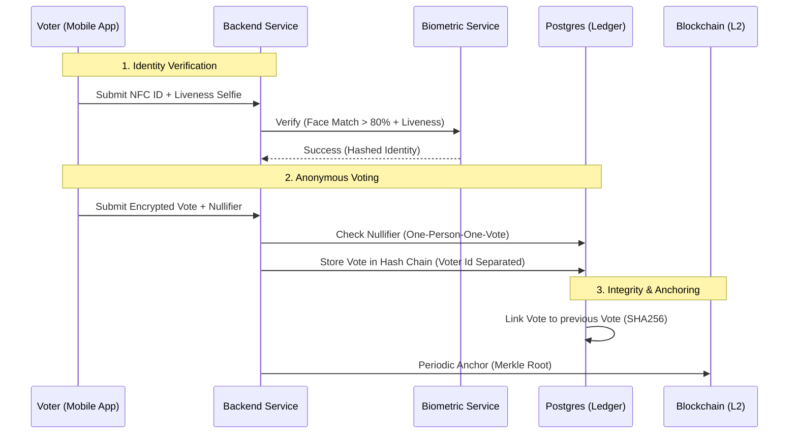
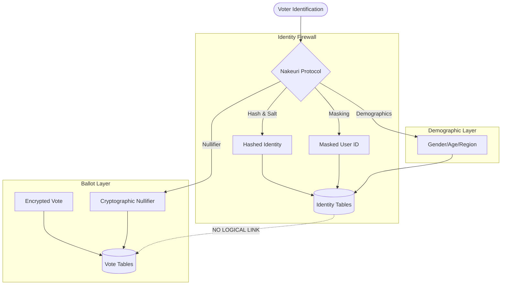
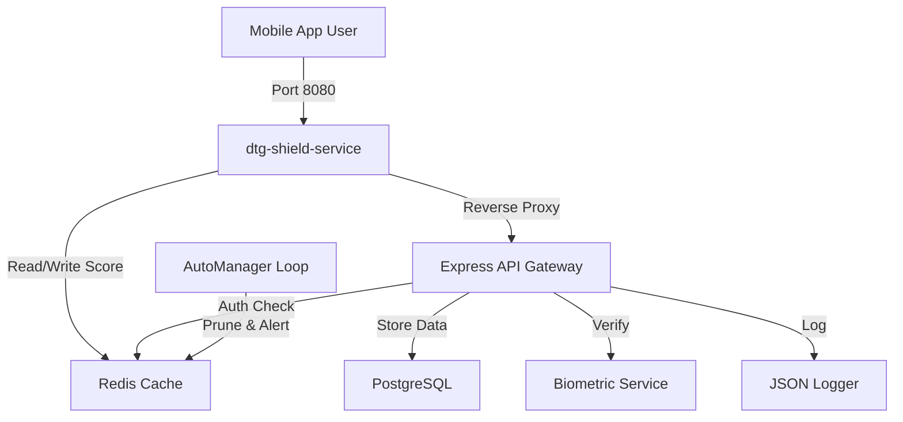

# Democracy Tools of Georgia (DTG) 🇬🇪

[](https://github.com/42prom/Democracy-Tools-of-Georgia/stargazers)
[](LICENSE)
[](https://github.com/42prom)

**Democracy Tools of Georgia (DTG)** is an enterprise-grade digital voting and referendum platform designed to ensure transparency, security, and accessibility.

Built on a custom **Flagship++ Protocol (designed by Mikheili Nakeuri)**, this system integrates:

- **Biometric Identity Verification**: AI-powered Face Matching & Liveness Detection.
- **eMRTD/NFC Scanning**: Passport/ID chip reading (ISO/IEC 14443).
- **Merkle Tree Integrity**: SHA-256 Merkle trees with blockchain-anchored roots for tamper-proof auditing.
- **Ed25519 Signed Receipts**: Every voter receives a cryptographically signed, independently verifiable ballot receipt.
- **Pluggable Cryptography**: HMAC-SHA256 (default) or Poseidon BN254 (ZK-SNARK ready) nullifier hashing.
- **Autonomous Security Shield**: AI-powered adaptive rate limiting and edge protection.
- **Enterprise Security**: Rate limits, Geo-blocking, and strict CORS policies.

---

## 🚀 Key Features

### 🛡️ Identity & Enrollment

- **NFC ePassport Reading**: Extract high-res photos and data directly from chips.
- **Liveness Detection**: Active & Passive Face Liveness to prevent spoofing.
- **Face Matching**: Verify selfie against ID photo with high confidence scoring.
- **Smart Image Optimization**: Automatic resizing and normalization of high-res biometric inputs.

### 🗳️ Voting Engine

- **Referendums & Polls**: Create dynamic, region-targeted polls.
- **Audience Filtering**: Target voters by age, region, and custom demographics.
- **Immutable Receipts**: Voters receive cryptographic proof of their vote.

### 🛡️ Autonomous Security

- **Adaptive Shield**: A standalone Python gateway that scores IP risk in real-time.
- **Edge Rejection**: Drops high-risk traffic before it even reaches the core backend.
- **Subnet Heuristics**: Automatically detects and alerts on clustered attack patterns.
- **Defense in Depth**:
  - **Static Rate Limiting**: 60 req/min (Auth), 300 req/min (API).
  - **Dynamic Protection**: Auto-ban IPs after repeated login/liveness failures.
- **Data Privacy**: k-Anonymity for analytics and strict data minimization.

---

## 🛠️ Technology Stack

| Layer            | Technologies                                                                    |
| :--------------- | :------------------------------------------------------------------------------ |
| **Mobile**       | Flutter, NFC Manager, ML Kit (Face Detection), flutter_image_compress           |
| **Backend**      | Node.js, TypeScript, Express, Helmet, CORS                                      |
| **Database**     | PostgreSQL 15 (with GIN Indexes for Analytics), Redis (Rate Limiting)           |
| **Biometrics**   | Python, FastAPI, InsightFace / FaceNet                                          |
| **Cryptography** | Ed25519 (receipts), HMAC-SHA256 / Poseidon BN254 (nullifiers), SHA-256 (Merkle) |
| **Secrets**      | HashiCorp Vault (production), `.env` (development)                              |
| **Security**     | Python (FastAPI), Redis, CIDR Heuristics                                        |
| **DevOps**       | Docker Compose, Multi-stage builds, GitHub Actions (Integrity CI)               |

---

## 🗳️ Voting Protocol

The system implements a multi-layered security protocol to ensure election integrity, voter anonymity, and tamper-proof results.

### End-to-End Flow



### Protocol Highlights

1.  **Sovereign Identity**: Voters are verified via cryptographic NFC chips in government-issued documents, not just passwords.
2.  **Server-Computed Nullifiers**: A cryptographic nullifier is computed server-side using `HMAC(SECRET, voterSub|pollId)` — clients cannot forge or influence it. Prevents double-voting without linking voter identity to their choice.
3.  **Merkle Tree Ballot Ledger**: Every vote is a leaf in a SHA-256 Merkle tree per poll. The incremental Merkle root is updated atomically on every vote submission.
4.  **Ed25519 Signed Receipts**: Voters receive a cryptographically signed ballot receipt. Anyone can independently verify it using the server's public key via `GET /api/v1/public/receipt-pubkey`.
5.  **Blockchain Anchoring**: Periodic snapshots of each poll's Merkle root are anchored to a public blockchain (Ethereum/Polygon). Even database administrators cannot modify finalized results unnoticed.
6.  **Immutable Audit Log**: All security-critical events are written to a chained-hash log (`audit_log`). Any row modification, deletion, or insertion breaks the chain and is detected by the verification script.

---

## 🔒 Data Privacy & Profile Management

The system is engineered for **Privacy by Design**, ensuring that personal identity cannot be linked to individual votes.

### 1. Cryptographic Anonymization

- **No Raw Personal Data**: The system never stores raw Personal Numbers. Identifiers are converted into one-way cryptographic hashes (`SHA256(PN + Salt)`) immediately upon entry.
- **Identity Separation**: Voter profiles are stored in physically distinct tables from the ballot ledger (`votes`). There are no foreign keys or logical links between the identity layer and the voting layer.

#### Identity vs. Ballot Firewall



### 2. Profile Storage & Metadata

When a user enrolls, the following information is securely persisted:

- **Demographic Metadata**: Gender, Birth Year, and Region codes are extracted from the official ID chip. This data is used solely for **Targeted Polling** and **Aggregated Analytics**.
- **Device Binding**: A unique `device_key_thumbprint` binds the voter's identity to their specific hardware, preventing mass-automated voting from emulators or remote servers.
- **UI Masking**: Sensitive fields like the Personal Number are masked (e.g., `010**********`) before being sent to the UI, ensuring that even if a screen is captured, full PII is not leaked.

### 3. k-Anonymity Guardrails

Poll results and security logs are protected by a **k-anonymity threshold (k=30)**. If an audience or result group is too small to ensure anonymity, the system automatically suppresses the data to prevent re-identification through demographic filtering.

### 4. Session Security Policy

To mitigate the risk of device theft or unauthorized access, the system enforces a strict **24-Hour Re-Verification Policy**:

- **Token Expiry**: All enrollment and voting sessions expire exactly **24 hours** after issuance.
- **Mandatory Re-Auth**: After expiry, the mobile app creates a "Session Timeout" event and forces the user to re-verify their identity (NFC or Liveness Check) to regain access.
- **No Long-Lived Refresh Tokens**: The system relies on frequent, high-assurance biometric proofs rather than persistent credentials.

---

## 🏗️ Architecture



---

## � Getting Started

### Prerequisites

- **Node.js**: v18+
- **Docker**: v20+
- **Flutter**: v3.19+

### Quick Start (Development)

1.  **Clone the Repository**

    ```bash
    git clone https://github.com/42prom/Democracy-Tools-of-Georgia.git
    cd Democracy-Tools-of-Georgia
    ```

2.  **Start Infrastructure (Postgres, Redis)**

    ```bash
    docker-compose up -d postgres redis biometric-service dtg-shield-service
    ```

3.  **Setup & Run Backend**
    Copy the example environment file and generate secure secrets (see `.env.example` for instructions):

    ```bash
    cd backend
    cp ../.env.example .env
    # Edit .env and set secure keys
    npm install
    npm run migrate
    npm run dev
    ```

4.  **Setup & Run Admin Panel**

    ```bash
    cd admin
    cp ../.env.example .env
    npm install
    npm run dev
    ```

5.  **Run Biometric Service (Optional/Standalone)**

    ```bash
    cd biometric-service
    pip install -r requirements.txt
    python main.py     # Runs on port 8000
    ```

6.  **Run Mobile App**
    ```bash
    cd mobile
    flutter pub get
    flutter run
    ```

---

## � License

## 🤝 Community & Security

- **Contributing**: Read our [Contribution Guidelines](CONTRIBUTING.md) to get started.
- **Security**: Found a vulnerability? See our [Security Policy](SECURITY.md).

---

## 📄 License

This project is licensed under the MIT License - see the [LICENSE](LICENSE) file for details.

---

© 2026 Mikheili Nakeuri. Built for a better future.
