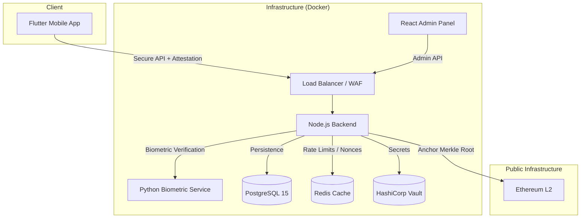

# System Architecture: Democracy Tools of Georgia (DTG) 🇬🇪

This document outlines the high-level architecture of the DTG system, focused on security, privacy, and auditability.

## 🏗️ Overview

DTG is a distributed system comprising a Flutter mobile app, a Node.js ecosystem (Backend & Admin), a Python-based Biometric microservice, and an Ethereum-compatible blockchain layer.

## 🛡️ Security Layers

### 1. Identity Verification

- **NFC eMRTD**: Direct extraction of data from passport/ID chip (ISO/IEC 14443).
- **Face Liveness**: Active (movement) and Passive (deep-learning) checks to prevent spoofing.
- **Face Matching**: Mathematical comparison of ID photo vs. high-res selfie.

### 2. Immutable Ballot Ledger

To prevent tampering by any party (including system admins), DTG implements a hybrid ledger:

- **Layer 1 (Merkle Tree)**: Every vote is hashed into a SHA-256 Merkle leaf. Each new vote updates the poll's incremental Merkle root atomically inside an ACID transaction. Any alteration to a past vote breaks the Merkle root.
- **Layer 2 (Blockchain)**: The `VoteAnchorService` runs every 10 minutes and anchors each poll's current Merkle root to the Ethereum blockchain. Any citizen can verify the database has not been rolled back since anchoring.
- **Ed25519 Receipts**: Every voter receives a signed ballot receipt. Independent verification is available at `GET /api/v1/public/verify-receipt`.
- **Audit Log**: All security events are written to a `audit_log` table with a cryptographic hash chain. `src/scripts/verify_audit_log.ts` detects any tampering.

### 3. Pluggable Cryptography

- **CryptoRegistry**: Selects between `HMAC-SHA256` (production) and `Poseidon BN254` (ZK-SNARK ready) via the `CRYPTO_HASHER` environment variable. Zero code change required.
- **ZK-SNARK Scaffolding**: Circom circuit `circuits/nullifier.circom` allows voters to prove knowledge of their nullifier's preimage without revealing identity.
- **Secrets Management**: HashiCorp Vault is the primary secrets backend in production. `.env` is the fallback for development.

### 4. Data Privacy

- **k-Anonymity**: Aggregated stats are only displayed if they represent at least `k` individuals (default k=30).
- **Nullifiers**: Cryptographic blinded identifiers used to ensure "one-person-one-vote" without linking a voter's identity to their choice.

## 📁 Technical Documentation

- [Component Map](./architecture/components.md)
- [Vote Session Sequence](./architecture/sequence_vote_session.md)
- [Enrollment Flow](./architecture/sequence_enrollment.md)

---

© 2026 Mikheili Nakeuri. **Designed by Mikheili Nakeuri (Flagship++ Protocol).**
