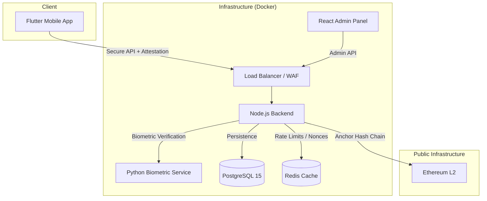

# System Architecture: Democracy Tools of Georgia (DTG) 🇬🇪

This document outlines the high-level architecture of the DTG system, focused on security, privacy, and auditability.

## 🏗️ Overview

DTG is a distributed system comprising a Flutter mobile app, a Node.js ecosystem (Backend & Admin), a Python-based Biometric microservice, and an Ethereum-compatible blockchain layer.

```mermaid
graph TD
    subgraph Client
        App[Flutter Mobile App]
    end

    subgraph "Infrastructure (Docker)"
        LB[Load Balancer / WAF]
        API[Node.js Backend]
        Admin[React Admin Panel]
        Bio[Python Biometric Service]
        DB[(PostgreSQL 15)]
        Redis[(Redis Cache)]
    end

    subgraph "Public Infrastructure"
        BC[Ethereum L2]
    end

    App -->|Secure API + Attestation| LB
    Admin -->|Admin API| LB
    LB --> API

    API -->|Biometric Verification| Bio
    API -->|Persistence| DB
    API -->|Rate Limits / Nonces| Redis

    API -->|Anchor Hash Chain| BC
```

## 🛡️ Security Layers

### 1. Identity Verification

- **NFC eMRTD**: Direct extraction of data from passport/ID chip (ISO/IEC 14443).
- **Face Liveness**: Active (movement) and Passive (deep-learning) checks to prevent spoofing.
- **Face Matching**: Mathematical comparison of ID photo vs. high-res selfie.

### 2. Immutable Ballot Ledger

To prevent tampering by any party (including system admins), DTG implements a hybrid ledger:

- **Layer 1 (Internal)**: Every vote contains a `vote_hash` and a `chain_hash`. The `chain_hash` is a SHA256 linkage of the current vote to the previous one. Any alteration in a previous vote breaks the entire chain.
- **Layer 2 (Blockchain)**: Periodic "Anchors" are sent to the Ethereum blockchain. These anchors contain the `chain_hash` for a specific poll at a point in time, allowing any citizen to verify that the database has not been rolled back or modified since the anchor was created.

### 3. Data Privacy

- **k-Anonymity**: Aggregated stats are only displayed if they represent at least `k` individuals (default k=30).
- **Nullifiers**: Cryptographic blinded identifiers used to ensure "one-person-one-vote" without linking a voter's identity to their choice.

## 📁 Technical Documentation

- [Component Map](./architecture/components.md)
- [Vote Session Sequence](./architecture/sequence_vote_session.md)
- [Enrollment Flow](./architecture/sequence_enrollment.md)

---

© 2026 Mikheili Nakeuri. **Designed by Mikheili Nakeuri (Flagship++ Protocol).**
