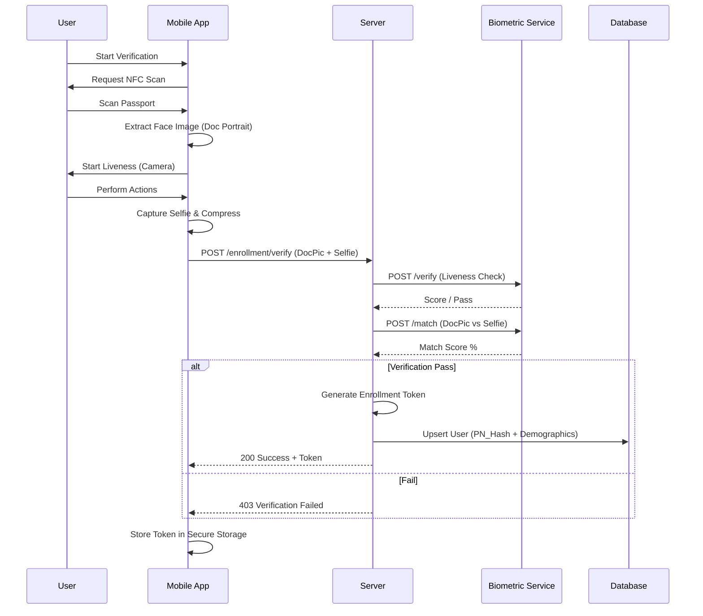

# Enrollment Sequence

```mermaid
sequenceDiagram
    participant U as User
    participant App as Mobile App
    participant S as Server
    participant Bio as Biometric Service
    participant DB as Database

    U->>App: Start Verification
    App->>U: Request NFC Scan
    U->>App: Scan Passport
    App->>App: Extract Face Image (Doc Portrait)

    App->>U: Start Liveness (Camera)
    U->>App: Perform Actions
    App->>App: Capture Selfie & Compress

    App->>S: POST /enrollment/verify (DocPic + Selfie)

    S->>Bio: POST /verify (Liveness Check)
    Bio-->>S: Score / Pass

    S->>Bio: POST /match (DocPic vs Selfie)
    Bio-->>S: Match Score %

    alt Verification Pass
        S->>S: Generate Enrollment Token
        S->>DB: Upsert User (PN_Hash + Demographics)
        S-->>App: 200 Success + Token
    else Fail
        S-->>App: 403 Verification Failed
    end

    App->>App: Store Token in Secure Storage
```
