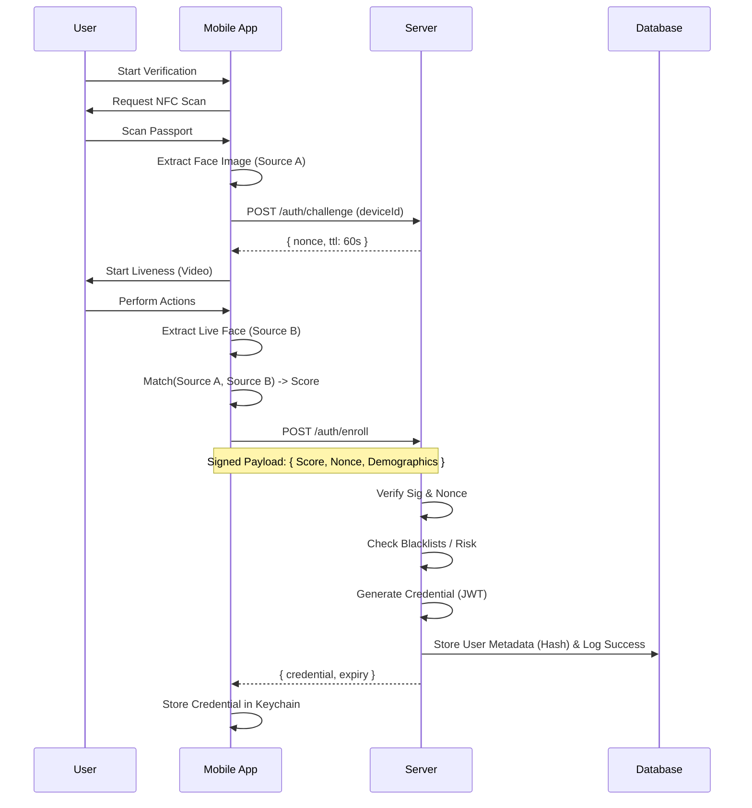

# Enrollment Sequence

```mermaid
sequenceDiagram
    participant U as User
    participant App as Mobile App
    participant S as Server
    participant DB as Database

    U->>App: Start Verification
    App->>U: Request NFC Scan
    U->>App: Scan Passport
    App->>App: Extract Face Image (Source A)

    App->>S: POST /auth/challenge (deviceId)
    S-->>App: { nonce, ttl: 60s }

    App->>U: Start Liveness (Video)
    U->>App: Perform Actions
    App->>App: Extract Live Face (Source B)
    App->>App: Match(Source A, Source B) -> Score

    App->>S: POST /auth/enroll
    Note over App,S: Signed Payload: { Score, Nonce, Demographics }

    S->>S: Verify Sig & Nonce
    S->>S: Check Blacklists / Risk
    S->>S: Generate Credential (JWT)

    S->>DB: Store User Metadata (Hash) & Log Success
    S-->>App: { credential, expiry }

    App->>App: Store Credential in Keychain
```
