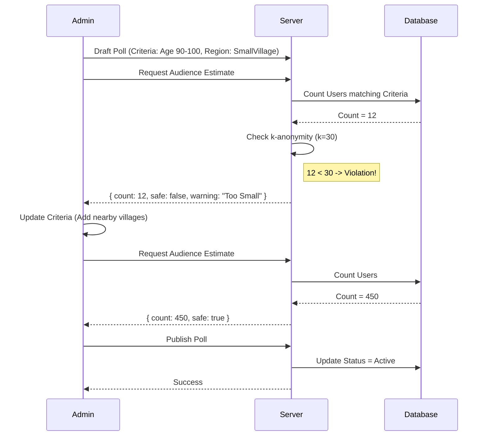

# Poll Publish Sequence

```mermaid
sequenceDiagram
    participant Admin
    participant S as Server
    participant DB as Database

    Admin->>S: Draft Poll (Criteria: Age 90-100, Region: SmallVillage)
    Admin->>S: Request Audience Estimate

    S->>DB: Count Users matching Criteria
    DB-->>S: Count = 12

    S->>S: Check k-anonymity (k=30)
    Note right of S: 12 < 30 -> Violation!

    S-->>Admin: { count: 12, safe: false, warning: "Too Small" }

    Admin->>Admin: Update Criteria (Add nearby villages)
    Admin->>S: Request Audience Estimate
    S->>DB: Count Users
    DB-->>S: Count = 450
    S-->>Admin: { count: 450, safe: true }

    Admin->>S: Publish Poll
    S->>DB: Update Status = Active
    S-->>Admin: Success
```
