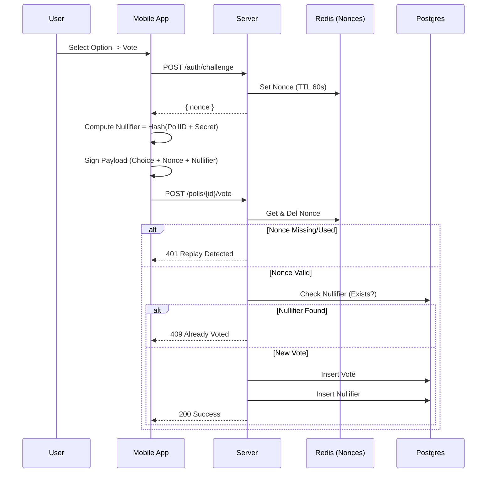

# Vote Session Sequence

```mermaid
sequenceDiagram
    participant U as User
    participant App as Mobile App
    participant S as Server
    participant R as Redis (Nonces)
    participant DB as Postgres

    U->>App: Select Option -> Vote
    App->>S: POST /auth/challenge
    S->>R: Set Nonce (TTL 60s)
    S-->>App: { nonce }

    App->>App: Compute Nullifier = Hash(PollID + Secret)
    App->>App: Sign Payload (Choice + Nonce + Nullifier)

    App->>S: POST /polls/{id}/vote

    S->>R: Get & Del Nonce
    alt Nonce Missing/Used
        S-->>App: 401 Replay Detected
    else Nonce Valid
        S->>DB: Check Nullifier (Exists?)
        alt Nullifier Found
            S-->>App: 409 Already Voted
        else New Vote
            S->>DB: Insert Vote
            S->>DB: Insert Nullifier
            S-->>App: 200 Success
        end
    end
```
