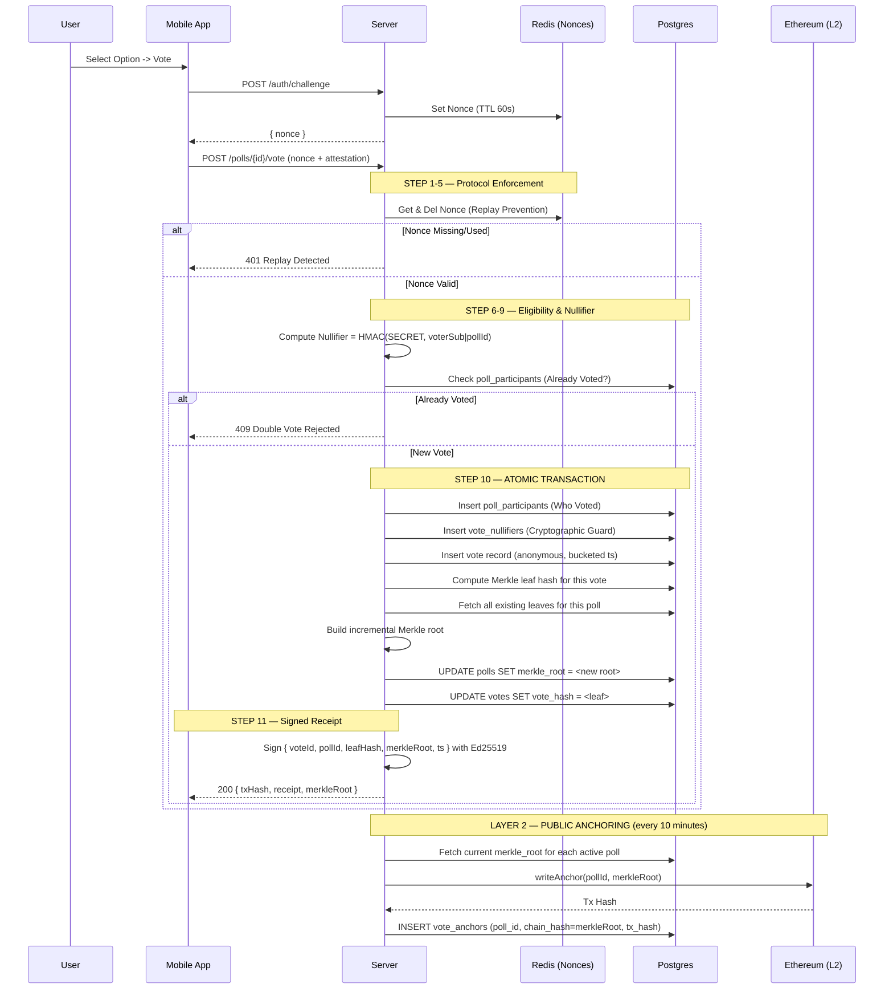

# Vote Session Sequence

```mermaid
sequenceDiagram
    participant U as User
    participant App as Mobile App
    participant S as Server
    participant R as Redis (Nonces)
    participant DB as Postgres
    participant BC as Ethereum (L2)

    U->>App: Select Option -> Vote
    App->>S: POST /auth/challenge
    S->>R: Set Nonce (TTL 60s)
    S-->>App: { nonce }

    App->>S: POST /polls/{id}/vote (nonce + attestation)

    Note over S,R: STEP 1-5 — Protocol Enforcement
    S->>R: Get & Del Nonce (Replay Prevention)
    alt Nonce Missing/Used
        S-->>App: 401 Replay Detected
    else Nonce Valid
        Note over S,DB: STEP 6-9 — Eligibility & Nullifier
        S->>S: Compute Nullifier = HMAC(SECRET, voterSub|pollId)
        S->>DB: Check poll_participants (Already Voted?)
        alt Already Voted
            S-->>App: 409 Double Vote Rejected
        else New Vote

            Note over S,DB: STEP 10 — ATOMIC TRANSACTION
            S->>DB: Insert poll_participants (Who Voted)
            S->>DB: Insert vote_nullifiers (Cryptographic Guard)
            S->>DB: Insert vote record (anonymous, bucketed ts)
            S->>DB: Compute Merkle leaf hash for this vote
            S->>DB: Fetch all existing leaves for this poll
            S->>S: Build incremental Merkle root
            S->>DB: UPDATE polls SET merkle_root = <new root>
            S->>DB: UPDATE votes SET vote_hash = <leaf>

            Note over S,App: STEP 11 — Signed Receipt
            S->>S: Sign { voteId, pollId, leafHash, merkleRoot, ts } with Ed25519
            S-->>App: 200 { txHash, receipt, merkleRoot }
        end
    end

    Note over S,BC: LAYER 2 — PUBLIC ANCHORING (every 10 minutes)
    S->>DB: Fetch current merkle_root for each active poll
    S->>BC: writeAnchor(pollId, merkleRoot)
    BC-->>S: Tx Hash
    S->>DB: INSERT vote_anchors (poll_id, chain_hash=merkleRoot, tx_hash)
```
