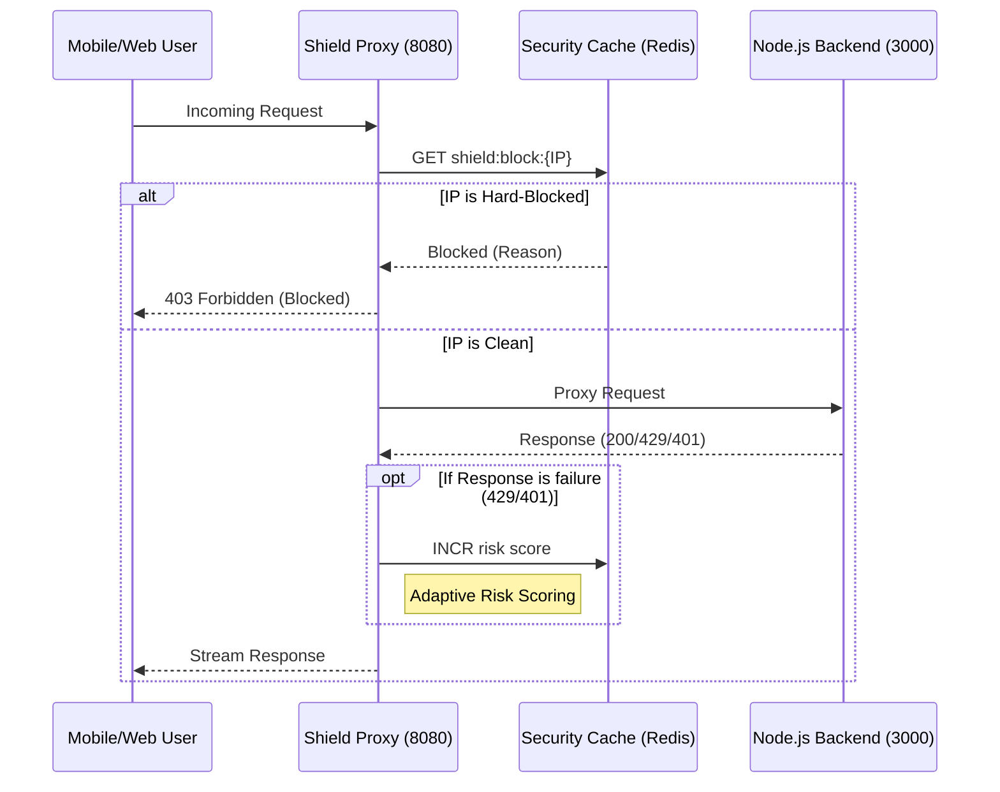

# 🛡️ dtg-shield-service — Autonomous Security Shield

The `dtg-shield-service` is an autonomous, high-performance security microservice designed as the "Early Guardian" for the Democracy Tools of Georgia ecosystem. It acts as a smart reverse proxy that scores incoming traffic risk in real-time and protects the core Node.js backend from malicious activity.

---

## 🏛️ Architectural Principles

### 1. Zero-Latency Guarding

The Shield is built using **FastAPI (Python)** and leverages **Redis** for O(1) risk lookups. Every request is inspected at the edge before it even reaches the application layer.

### 2. Signal Aggregation

It doesn't just look at IP history; it ingest signals from across the stack:

- **Backend Rate Limit Hotspots**: Reads `rl:*` keys from the main backend.
- **Biometric Failures**: Implicitly weights IPs that frequently fail liveness/matching.
- **Manual Overrides**: Allows administrators to hard-drop IPs with 0ms latency.

### 3. Heuristic Autonomy (AutoManager)

The system includes a background "AI manager" that analyzes block patterns to detect **Subnet Clustering**. If multiple IPs from the same /24 CIDR are blocked, the system escalates the risk level for the entire range.

---

## 📊 Operational Flow



---

## 🛡️ Risk Scoring Engine

Incoming IPs are assigned a **Risk Score (0-100)**. When an IP hits **100**, it is automatically transitioned to a `Hard-Blocked` state.

| Event                    | Score Penalty | Default Threshold |
| :----------------------- | :------------ | :---------------- |
| Backend 429 (Rate Limit) | +20           | 5 hits = Block    |
| Backend 401 (Auth Fail)  | +15           | 7 hits = Block    |
| Biometric/Liveness Fail  | +25           | 4 hits = Block    |
| Admin Manual Flag        | +100          | Immediate Block   |

### CIDR Clustering Heuristic

The **AutoManager** runs every 60 seconds and performs the following logic:

1. Scan all `shield:block:*` keys.
2. Group IPs by `/24` subnet.
3. If a subnet has `>3` blocked IPs, log a **Subnet Attack Alert** and escalate risk for all active IPs in that range.

---

## 🛠️ Tech Stack & Specs

- **Runtime**: Python 3.11 (optimized with `uvicorn`)
- **Framework**: FastAPI (Asynchronous & Non-blocking)
- **Proxy Engine**: `httpx` (Streaming Response support)
- **Monitoring**: Integration with DTG Admin Panel via Redis sub-keys.

### Resource Specs

- **Memory Footprint**: < 40MB RAM (at idle)
- **Latency Budget**: +2ms to +8ms per request (typical)
- **Concurrency**: High-concurrency support via Python `asyncio`.

---

## 🚀 Installation & Deployment

### Environment Variables

| Variable          | Default                    | Description                  |
| :---------------- | :------------------------- | :--------------------------- |
| `BACKEND_URL`     | `http://localhost:3000`    | The target Node.js API       |
| `REDIS_URL`       | `redis://localhost:6379/0` | Shared Redis instance        |
| `PORT`            | `8080`                     | Proxy listening port         |
| `BLOCK_THRESHOLD` | `100`                      | Score at which IP is dropped |

### Docker Deployment

```bash
docker build -t dtg-shield-service .
docker run -p 8080:8080 \
  -e BACKEND_URL=http://host.docker.internal:3000 \
  -e REDIS_URL=redis://redis_host:6379/0 \
  dtg-shield-service
```

---

## 🤝 Integration Specifications

The Shield service uses a standard Redis key-space to communicate with the **DTG Admin Panel**:

- `shield:block:{IP}`: String (value=reason)
- `shield:risk:{IP}`: Int (current score)
- `shield:logs:{IP}`: List (JSON entries of risk events)
- `shield:alerts`: List (Heuristic alerts for admin dashboard)

---

© 2026 Democracy Tools Of Georgia. Autonomous security layer built for high-trust environments.
